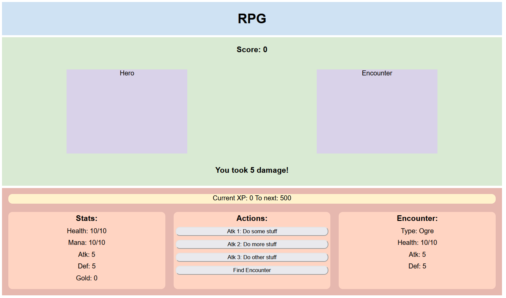

# Planning

## Game Choice

A simple brower RPG a la classic final fantasy games, minus the overworld (so just encounter to encounter)

## Wireframe
Mock Up:

Html:


## Psuedocode

```
1) Define required constants
    1.a) Define Hero and Enemy class
    1.b) Define a list of possible encounters

2) Define required variables used to track the state of the game

3) Store elements on the page that will be accessed in code more than once in variables to make code more concise, readable and performant.

4) Upon loading the app should:
  4.a) Create a new Hero, and Initialize the state variables
  4.b) Render those values to the page
  4.c) Wait for the player to click the next encounter button

5) When next encounter is clicked, findEncounter(): randomly picks an encounter from a predetermined list
    4.a) If the encounter is an enemy, initCombat()
    4.b) Otherwise, do some effect (add gold, give xp, or boost player stats)
    4,c) Render
    4.d) Wait for the player to click the next encounter button

6) when initCombat() starts, create a new Enemy object 
    6.a) Render the new state on the page.
    6.b) Wait for the player to click an ability button to fight()
    6.c) If the enemy hp reaches 0, increase player XP and gold.
    6.d) if player xp reaches max, levelup() increase player stats
    6.e) wait for the player to click find Encounter
    6.d) if player hp reaches 0, game over

7) when the player clicks and ability, fight() to reduce enemy hp
    7.a) the enemy randomly picks an attack to fight() with
    7.b) render

Icebox Features:
- Add sound when abilities are used
- Add multiple different enemies and player classes